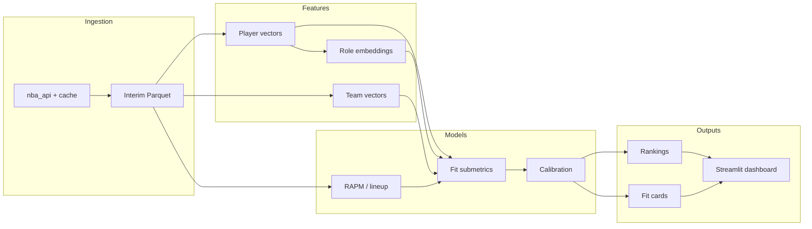

# NBA Fit Analysis

Public-data basketball analytics pipeline that scores **player–team fit**: which destinations suit a player, and which players best address a team’s needs. Outputs are **interpretable** (decomposed submetrics, fit cards, uncertainty bands) rather than a single opaque score.

Built on [`nba_api`](https://github.com/swar/nba_api) with optional `pbpstats` for possession context. No proprietary tracking or paywalled data required.

**Repository:** https://github.com/gerardcabot/nba-fit-analysis

---

## What it answers

| Question | Command / view |
|----------|----------------|
| Where should this player sign? | `rank-player`, dashboard **Player Destination Explorer** |
| Who should this team target? | `rank-team`, **Team Target Board** |
| Why does this pairing score well or poorly? | `rank-player --fit-card-team`, **Fit Card** |
| Which lineups improve if he replaces rotation minutes? | `lineup-sim`, fit card `lineup_synergy` |
| Does the model calibrate on historical moves? | `backtest-movement`, **Backtest Report** |

---

## Architecture

The system is implemented in **four stacked layers** (Options A → D), each adding signal to the final ensemble.



| Layer | Branch (see [docs/BRANCHING.md](docs/BRANCHING.md)) | Adds |
|-------|-----------------------------------------------------|------|
| **Foundation** | `stage/00-foundation` | Package, Parquet cache, endpoint registry, health CLI |
| **Option A** | `stage/01-option-a` | Interpretable fit index, rankings, fit cards |
| **Option B** | `stage/02-option-b` | Role embeddings, archetypes, team-need fit |
| **Option C** | `stage/03-option-c` | RAPM-style impact, lineup simulation |
| **Option D** | `stage/04-option-d` | Calibrated ensemble, movement backtest, dashboard |

The full product lives on **`stage/04-option-d`** (or `main` after merging the stacked PRs).

---

## Requirements

- **Python 3.10+**
- Network access to `stats.nba.com` for live ingest (cached afterward)
- ~2–5 GB disk for a full season of cached raw + interim data (depends on ingest tiers)

---

## Installation

```bash
git clone https://github.com/gerardcabot/nba-fit-analysis.git
cd nba-fit-analysis

python -m venv .venv
# Windows
.venv\Scripts\activate
# macOS / Linux
# source .venv/bin/activate

pip install -e ".[dev]"
```

Optional extras:

```bash
pip install -e ".[dashboard]"   # Streamlit UI
pip install -e ".[scraping]"    # probe / fallback scrapers only
```

---

## Quick start

### 1. Check data sources

Uses the committed endpoint probe (`probe_all_results.json`):

```bash
python -m nba_fit health
```

Regenerate probes locally (slow; hits every `nba_api` endpoint):

```bash
python probe_all_nba_endpoints.py
```

### 2. Ingest data (by tier)

| Tier | Flag | Contents |
|------|------|----------|
| MVP | `--tier mvp` | League player/team dashboards, shot locations, estimated metrics |
| Role | `--tier role` | Lineups, on/off summaries (30 teams × endpoints; long first run) |
| Impact | `--tier impact` | Play-by-play + rotation → possession tables (`--max-games` caps API load) |

```bash
python -m nba_fit ingest --season 2025-26 --tier mvp
python -m nba_fit ingest --season 2025-26 --tier role
python -m nba_fit ingest --season 2025-26 --tier impact --max-games 50
```

Cached responses are written under `data/raw/`; normalized tables under `data/interim/`. See [docs/STORAGE.md](docs/STORAGE.md).

### 3. Train models

```bash
python -m nba_fit train-roles --season 2025-26
python -m nba_fit train-impact --season 2025-26
```

### 4. Rank and inspect

```bash
# Best teams for LeBron James (player_id 2544)
python -m nba_fit rank-player 2544 --season 2025-26 --top 10

# Best targets for the Lakers (team_id 1610612747)
python -m nba_fit rank-team 1610612747 --season 2025-26

# Full JSON fit card for one player–team pair
python -m nba_fit rank-player 2544 --fit-card-team 1610612747 --season 2025-26

# Team need × role-fit target board
python -m nba_fit archetype-board 1610612747 --season 2025-26

# Top projected five-man units + net rating delta
python -m nba_fit lineup-sim 2544 1610612747 --season 2025-26
```

### 5. Offline demo (no API)

Every ranking and training command accepts `--synthetic` for deterministic demo data:

```bash
python -m nba_fit rank-player 2544 --synthetic
python -m nba_fit train-roles --synthetic
python -m nba_fit lineup-sim --synthetic
```

### 6. Dashboard

```bash
pip install -e ".[dashboard]"
streamlit run src/nba_fit/app/dashboard.py
```

Enable **Synthetic demo data** in the sidebar when you have not run ingest.

---

## CLI reference

| Command | Description |
|---------|-------------|
| `health` | Endpoint health from local probe registry |
| `fetch-sample --endpoint NAME` | Smoke-fetch one endpoint into raw cache |
| `ingest --tier {mvp,role,impact}` | Fetch + normalize to interim Parquet |
| `rank-player PLAYER_ID` | Rank all teams for a player |
| `rank-team TEAM_ID` | Rank all players for a team |
| `train-roles` | Fit role embeddings, archetypes, team need, NN comps |
| `train-impact` | Fit ridge RAPM + lineup net-rating model |
| `archetype-board TEAM_ID` | Rank players by team-need × role fit |
| `lineup-sim [PLAYER_ID] [TEAM_ID]` | Project lineup units and rating delta |
| `backtest-movement --season YYYY-YY` | Movement + holdout-season smoke evaluation |

Common flags: `--season 2025-26`, `--synthetic`, `--top N`, `--no-cache`.

Entry points: `python -m nba_fit` or `nba-fit`.

---

## Fit card outputs

A fit card is JSON-friendly metadata for one player on one team. Typical fields:

| Field | Meaning |
|-------|---------|
| `overall_fit_percentile` | Calibrated percentile vs all player–team pairs that season |
| `raw_fit_score` | Pre-calibration weighted ensemble |
| `offensive_fit`, `defensive_fit`, … | Interpretable submetrics in \([0, 1]\) |
| `team_need_fit` | Team-need × embedding alignment (Option B); alias `role_fit` |
| `projected_net_rating_delta` | Minutes-weighted lineup impact proxy (Option C) |
| `archetype` | Heuristic cluster label (e.g. movement shooter) |
| `comps` | Nearest neighbors in role-embedding space |
| `lineup_synergy` | Top projected five-man units and deltas |
| `fit_uncertainty.low_percentile` / `fit_uncertainty.high_percentile` | Ensemble disagreement band (Option D) |
| `components_degraded` / `fallbacks` | Submetrics that used neutral 0.5 (missing Option B/C artifacts) |
| `ensemble` / `ensemble_contributions` | Decomposed calibrated ensemble |

Weights and thresholds are defined in `src/nba_fit/scoring/constants.py`, `features/constants.py`, and `models/constants.py` with inline basketball rationale—no undocumented magic numbers in scoring logic.

---

## Scoring model (summary)

**Option A — profile fit:** robust z-scored player vs team vectors; submetrics for offensive/defensive complementarity, role cosine similarity, usage, shot diet, spacing, replacement value.

**Option B — role fit:** truncated-SVD embeddings, GMM archetypes, team-need vectors from roster gaps and weakness proxies.

**Option C — lineup impact:** recency-weighted ridge RAPM (off/def split) and a lineup net-rating model; simulates replacing low-end rotation minutes.

**Option D — ensemble:** combines profile, role, team need, projected impact, replacement, and risk penalty; isotonic/percentile calibration; movement backtest and uncertainty bands.

---

## Data sources and limits

| Source | Role |
|--------|------|
| **nba_api** | Primary: rosters, dashboards, shots, lineups, on/off, PBP v3, box scores |
| **pbpstats** | Possession parsing when compatible; fallback builds possessions from PBP + rotation |
| **probe scripts** | `probe_all_nba_endpoints.py`, `test_nba_data.py` — schema validation |

**Known limits (public data):**

- No current SportVU-style frame tracking; spacing uses shot geography and aggregates.
- `synergyplaytypes` is unreliable (empty in probes)—play types are proxied from usage and shot behavior.
- Lineup ratings are noisy; RAPM uses regularization, recency weighting, and uncertainty intervals.
- Movement backtests are **selected** (teams do not move players at random)—report calibration, not causality.

Endpoint catalog: [docs/NBA_ENDPOINTS_DATA_REFERENCE.md](docs/NBA_ENDPOINTS_DATA_REFERENCE.md).

---

## Project layout

```
nba-fit-analysis/
├── src/nba_fit/
│   ├── config/          # seasons, paths, endpoint registry
│   ├── data/            # client, ingest, fetchers, storage
│   ├── normalize/       # players, teams, lineups, possessions
│   ├── features/        # player/team vectors, scaling, team need
│   ├── models/          # embeddings, RAPM, calibration
│   ├── scoring/         # submetrics, ensemble, ranker, fit cards
│   ├── evaluation/      # movement backtest, holdout season
│   └── app/             # Streamlit dashboard
├── tests/               # unit and smoke tests
├── visual_tests/        # matplotlib diagnostic plots → reports/figures/
├── docs/                # storage, branching, endpoint reference
├── probe_*.py           # data discovery utilities
└── data/                # gitignored cache (raw, interim, features)
```

---

## Testing

**Unit / integration tests:**

```bash
pytest
```

**Visual validation** (writes PNGs under `reports/figures/`):

```bash
# Windows
.\scripts\run_visual_tests.ps1

# or individually
python visual_tests/01_endpoint_health.py
python visual_tests/05_fit_score_heatmap.py
python visual_tests/12_calibration_curve.py
```

Listings: [visual_tests/README.md](visual_tests/README.md).

---

## Development workflow

This repo uses a **concatenated branch strategy**: each stage branch builds on the previous one. Merge stacked pull requests in order (`#1` → `#5`) into `main`. Details: [docs/BRANCHING.md](docs/BRANCHING.md).

`main` is **branch-protected** (no force-push or deletion; changes via pull request).

---

## Contributing

1. Branch from the latest stage branch or `main`.
2. Keep constants documented with basketball or statistical rationale.
3. Add or update tests for new behavior; add a `visual_tests/` script when introducing new feature distributions.
4. Open a PR against the appropriate base branch.

---

## License

MIT (see [pyproject.toml](pyproject.toml)).

---

## Acknowledgements

- [swar/nba_api](https://github.com/swar/nba_api) — NBA.com stats client  
- [pbpstats](https://pbpstats.readthedocs.io/) — possession and lineup context  
- Dean Oliver / public analytics literature — pace, efficiency, and sample-size conventions referenced in feature constants
